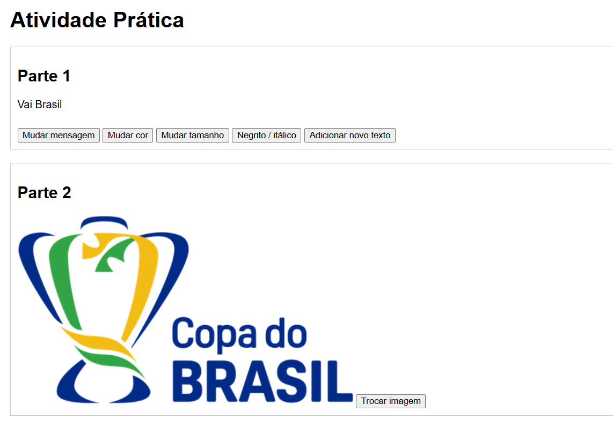
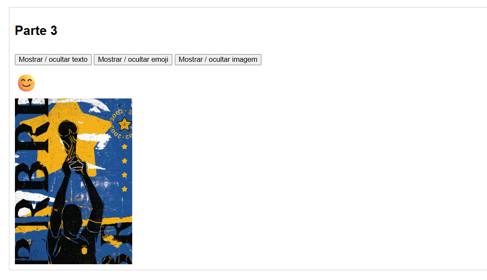
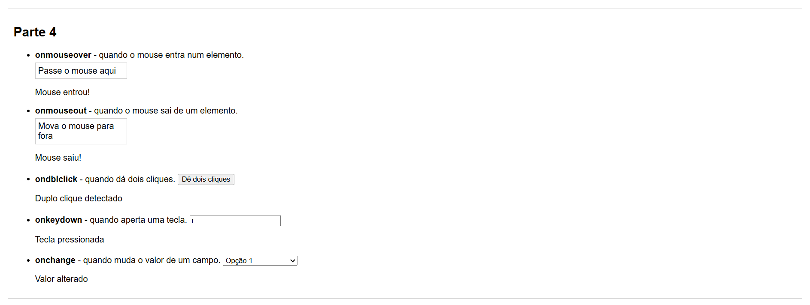

# Prática de JavaScript

## Descrição

Atividade prática desenvolvida em JavaScript puro com foco em manipulação do DOM, eventos e interatividade. O projeto demonstra conceitos fundamentais como:

- **Manipulação de Texto**: Alteração de conteúdo, cores, tamanhos e estilos de elementos
- **Manipulação de Imagens**: Troca dinâmica de imagens
- **Mostrar/Ocultar Elementos**: Controle de visibilidade com JavaScript
- **Eventos**: Utilização de eventos como `onclick`, `onmouseover` e outros

## Tecnologias Utilizadas

- HTML5
- CSS3
- JavaScript Vanilla

## Exemplos do Projeto

### Exemplo 1 - Manipulação de Texto

### Exemplo 2 - Interatividade com Imagens
Funcionalidade para trocar imagens dinamicamente através de botões interativos.

### Exemplo 3 - Mostrar/Ocultar Elementos

## Funcionalidades

✅ Mudar texto e mensagens  
✅ Alterar cores e tamanhos de fonte  
✅ Aplicar estilos (negrito e itálico)  
✅ Trocar imagens  
✅ Mostrar e ocultar elementos  
✅ Interação com eventos do mouse 

